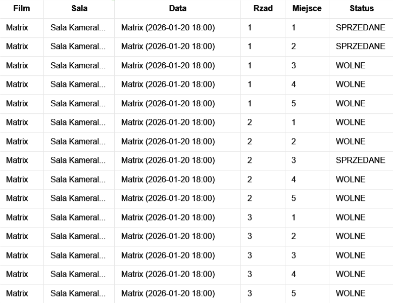

# Pomysł 2: Kino — rezerwacja i sprzedaż biletów

Cel: zarządzanie salami, seansami, miejscami i rezerwacjami biletów, z różnymi typami sal lub projekcji.

## Przykładowe użycie (fragmenty interfejsu)

## 1. Tworzenie sal (2 sale)

<pre class="not-prose w-full rounded font-mono text-sm font-extralight">

<button data-testid="copy-code-button" aria-label="Skopiuj kod" type="button" class="focus-visible:bg-subtle hover:bg-subtle text-quiet  hover:text-foreground dark:hover:bg-subtle font-sans focus:outline-none outline-none outline-transparent transition duration-300 ease-out select-none items-center relative group/button font-semimedium justify-center text-center items-center rounded-full cursor-pointer active:scale-[0.97] active:duration-150 active:ease-outExpo origin-center whitespace-nowrap inline-flex text-sm h-8 aspect-square" data-state="closed">

<svg role="img" class="inline-flex fill-current shrink-0" width="16" height="16"><use xlink:href="#pplx-icon-copy"></use></svg>

</button>

text

<code>=== 1. TWORZENIE SAL (2 sale) ===
✅ Utworzono: Sala Kameralna (10x10)
✅ Utworzono: Sala Kinowa Główna (15 rzędów, układ stadium)
</code>

</pre>

## 2. Tworzenie seansów (2 seanse)

<pre class="not-prose w-full rounded font-mono text-sm font-extralight">

<button data-testid="copy-code-button" aria-label="Skopiuj kod" type="button" class="focus-visible:bg-subtle hover:bg-subtle text-quiet  hover:text-foreground dark:hover:bg-subtle font-sans focus:outline-none outline-none outline-transparent transition duration-300 ease-out select-none items-center relative group/button font-semimedium justify-center text-center items-center rounded-full cursor-pointer active:scale-[0.97] active:duration-150 active:ease-outExpo origin-center whitespace-nowrap inline-flex text-sm h-8 aspect-square" data-state="closed">

<svg role="img" class="inline-flex fill-current shrink-0" width="16" height="16"><use xlink:href="#pplx-icon-copy"></use></svg>

</button>

text

<code>=== 2. TWORZENIE SEANSÓW (2 seanse) ===
📽️ Seans 1: Matrix (2026-01-20 18:00) → Sala Kameralna
📽️ Seans 2: Avatar 2 (2026-01-20 20:00) → Sala Kinowa Główna
</code>

</pre>

## 3. Robienie rezerwacji

<pre class="not-prose w-full rounded font-mono text-sm font-extralight">

<button data-testid="copy-code-button" aria-label="Skopiuj kod" type="button" class="focus-visible:bg-subtle hover:bg-subtle text-quiet  hover:text-foreground dark:hover:bg-subtle font-sans focus:outline-none outline-none outline-transparent transition duration-300 ease-out select-none items-center relative group/button font-semimedium justify-center text-center items-center rounded-full cursor-pointer active:scale-[0.97] active:duration-150 active:ease-outExpo origin-center whitespace-nowrap inline-flex text-sm h-8 aspect-square" data-state="closed">

<svg role="img" class="inline-flex fill-current shrink-0" width="16" height="16"><use xlink:href="#pplx-icon-copy"></use></svg>

</button>

text

<code>=== 3. ROBIENIE REZERWACJI ===

>> Rezerwacja na Matrixa (ID: RES-001):
✅ SUKCES: Zarezerwowano miejsce: Rząd 1, M1
✅ SUKCES: Zarezerwowano miejsce: Rząd 1, M2  
✅ SUKCES: Zarezerwowano miejsce: Rząd 2, M3

>> Rezerwacja na Avatara (ID: RES-002):
✅ SUKCES: Zarezerwowano miejsce: Rząd 3, M5
✅ SUKCES: Zarezerwowano miejsce: Rząd 3, M6
✅ SUKCES: Zarezerwowano miejsce: Rząd 5, M10
</code>

</pre>

## 4. Mapa sali – Matrix (Sala Kameralna)

<pre class="not-prose w-full rounded font-mono text-sm font-extralight">

<button data-testid="copy-code-button" aria-label="Skopiuj kod" type="button" class="focus-visible:bg-subtle hover:bg-subtle text-quiet  hover:text-foreground dark:hover:bg-subtle font-sans focus:outline-none outline-none outline-transparent transition duration-300 ease-out select-none items-center relative group/button font-semimedium justify-center text-center items-center rounded-full cursor-pointer active:scale-[0.97] active:duration-150 active:ease-outExpo origin-center whitespace-nowrap inline-flex text-sm h-8 aspect-square" data-state="closed">

<svg role="img" class="inline-flex fill-current shrink-0" width="16" height="16"><use xlink:href="#pplx-icon-copy"></use></svg>

</button>

text

<code>Mapa sali na film: Matrix (2026-01-20 18:00)
[X] [X] [_] [_] [_] [_] [_] [_] [_] [_]
[_] [_] [X] [_] [_] [_] [_] [_] [_] [_]
[_] [_] [_] [_] [_] [_] [_] [_] [_] [_]
[_] [_] [_] [_] [_] [_] [_] [_] [_] [_]
[_] [_] [_] [_] [_] [_] [_] [_] [_] [_]
[_] [_] [_] [_] [_] [_] [_] [_] [_] [_]
[_] [_] [_] [_] [_] [_] [_] [_] [_] [_]
[_] [_] [_] [_] [_] [_] [_] [_] [_] [_]
[_] [_] [_] [_] [_] [_] [_] [_] [_] [_]
[_] [_] [_] [_] [_] [_] [_] [_] [_] [_]
--------------------------------
</code>

</pre>

## 5. Mapa sali – Avatar 2 (Sala IMAX)

<pre class="not-prose w-full rounded font-mono text-sm font-extralight">

<button data-testid="copy-code-button" aria-label="Skopiuj kod" type="button" class="focus-visible:bg-subtle hover:bg-subtle text-quiet  hover:text-foreground dark:hover:bg-subtle font-sans focus:outline-none outline-none outline-transparent transition duration-300 ease-out select-none items-center relative group/button font-semimedium justify-center text-center items-center rounded-full cursor-pointer active:scale-[0.97] active:duration-150 active:ease-outExpo origin-center whitespace-nowrap inline-flex text-sm h-8 aspect-square" data-state="closed">

<svg role="img" class="inline-flex fill-current shrink-0" width="16" height="16"><use xlink:href="#pplx-icon-copy"></use></svg>

</button>

text

<code>Mapa sali na film: Avatar 2 (2026-01-20 20:00)
[_] [_] [_] [_] [_] [_] [_] [_] [_] [_]
[_] [_] [_] [_] [_] [_] [_] [_] [_] [_]
[_] [_] [_] [_] [X] [X] [_] [_] [_] [_]
[_] [_] [_] [_] [_] [_] [_] [_] [_] [_]
[_] [_] [_] [_] [_] [_] [_] [_] [_] [X]
[_] [_] [_] [_] [_] [_] [_] [_] [_] [_]
[_] [_] [_] [_] [_] [_] [_] [_] [_] [_]
[_] [_] [_] [_] [_] [_] [_] [_] [_] [_]
[_] [_] [_] [_] [_] [_] [_] [_] [_] [_]
[_] [_] [_] [_] [_] [_] [_] [_] [_] [_]
[_] [_] [_] [_] [_] [_] [_] [_] [_] [_]
[_] [_] [_] [_] [_] [_] [_] [_] [_] [_]
[_] [_] [_] [_] [_] [_] [_] [_] [_] [_]
[_] [_] [_] [_] [_] [_] [_] [_] [_] [_]
[_] [_] [_] [_] [_] [_] [_] [_] [_] [_]
----------------------------
</code>

</pre>

## 6. Eksport raportów CSV

<pre class="not-prose w-full rounded font-mono text-sm font-extralight">

<button data-testid="copy-code-button" aria-label="Skopiuj kod" type="button" class="focus-visible:bg-subtle hover:bg-subtle text-quiet  hover:text-foreground dark:hover:bg-subtle font-sans focus:outline-none outline-none outline-transparent transition duration-300 ease-out select-none items-center relative group/button font-semimedium justify-center text-center items-center rounded-full cursor-pointer active:scale-[0.97] active:duration-150 active:ease-outExpo origin-center whitespace-nowrap inline-flex text-sm h-8 aspect-square" data-state="closed">

<svg role="img" class="inline-flex fill-current shrink-0" width="16" height="16"><use xlink:href="#pplx-icon-copy"></use></svg>

</button>

text

<code>=== 4. EKSPORT RAPORTÓW CSV ===
✅ SUKCES: Wygenerowano raport CSV: raport_matrix.csv
✅ SUKCES: Wygenerowano raport CSV: raport_avatar.csv

=== KONIEC ===
📁 Sprawdź pliki .csv w folderze resources/cinema-reports/ !
</code>

</pre>

**Przykładowy plik CSV (`raport_matrix.csv`):**

